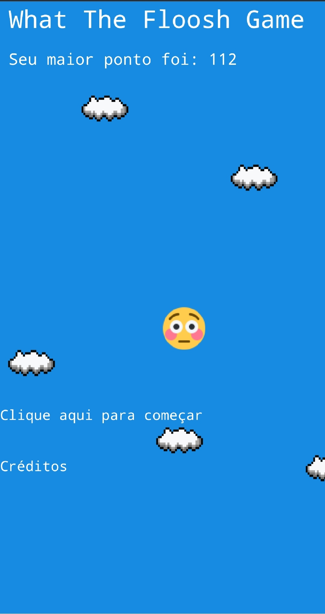
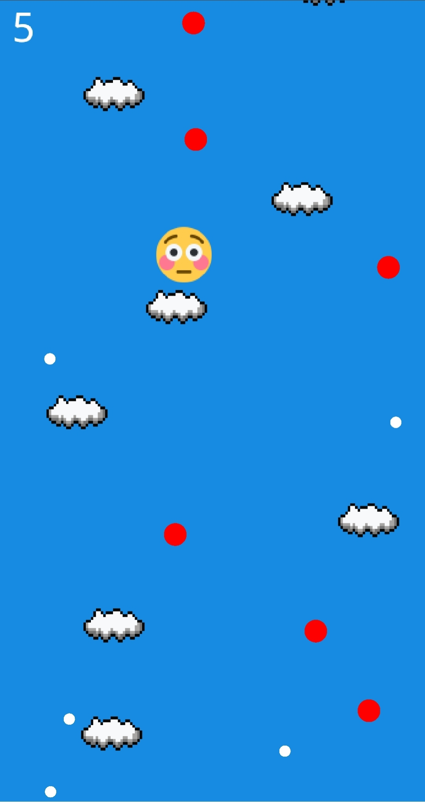
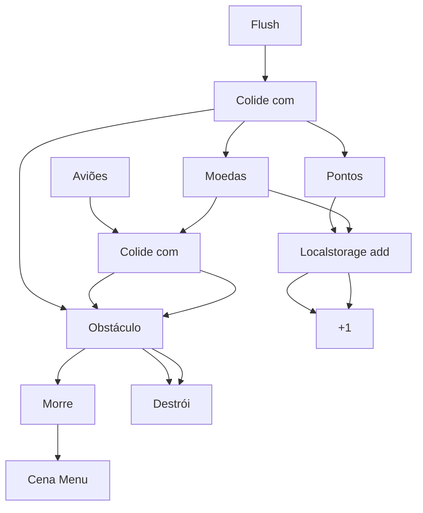

# What The Floosh Game
What The Floosh Game é um jogo em que você passa por estrelas e outros obstáculos para chegar em seu destino final (inexistente). O objetivo é conseguir mais pontos até acertar uma estrela ou qualquer outro obstáculo.

## Prévias

# Para quê essa github?
Simplesmente você pode ajudar a encontrar, vulnerabilidades, bugs, e até mesmo ajudar em questão de idéias.

*Aceito qualquer tipo de idéia*

# Como funciona?
Simples, você começa o jogo e é só desviar de alguns... obstáculos? Sei lá, só isso.

Sei, não dá pra entender, mas é o que eu sei explicar.
