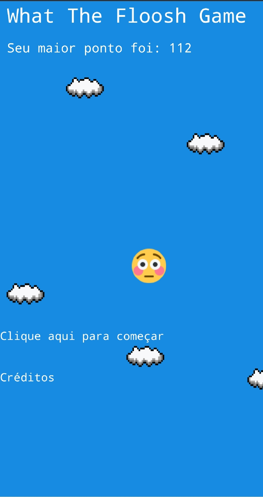
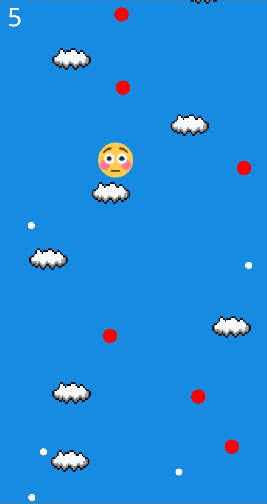

# Arquivado!
> [!WARNING]
> Esse repositorio do What The Floosh Game foi arquivado desde 02 de setembro de 2026.
> 
> Agora você pode acompanhar as atualizações por outro repositorio (que até o momento não está disponível) ou no meu [itch.io](igorwastaken.itch.io).

## What The Floosh Game

What The Floosh Game é um jogo em que você passa por estrelas e outros obstáculos para chegar em seu destino final (inexistente). O objetivo é conseguir mais pontos até acertar uma estrela ou qualquer outro obstáculo.

## Prévias

# Para quê essa github?

Simplesmente você pode ajudar a encontrar, vulnerabilidades, bugs, e até mesmo ajudar em questão de idéias.

_Aceito qualquer tipo de idéia_

# Planejamentos para Versão 3 do jogo:

- [x] Obstáculos melhores
- [x] Aprimoramento na jogabilidade
- [x] Novos recursos
  - [x] Algo que deixe o jogo empolgante
  - [ ] Configurações
  - [ ] Sistema de Ranking
- [x] Sons de interface
- [x] Mais melhorias
- [ ] Internacionalização, (outros idiomas)
- [ ] E muito mais!

Ajuda ae :)
